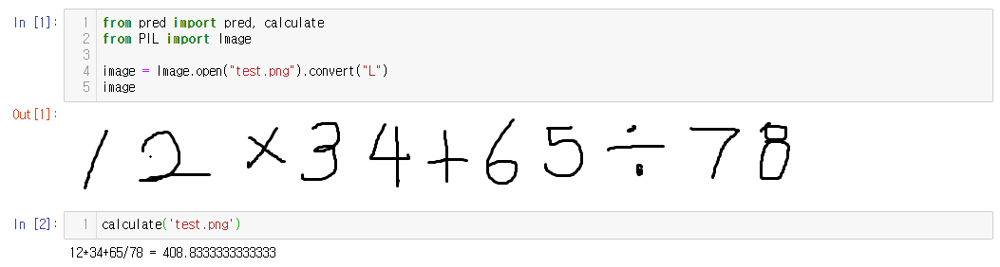
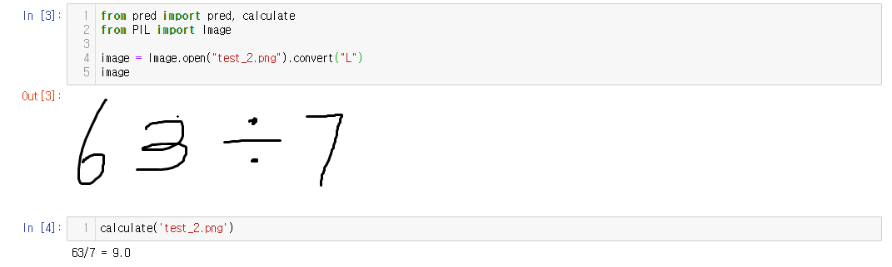
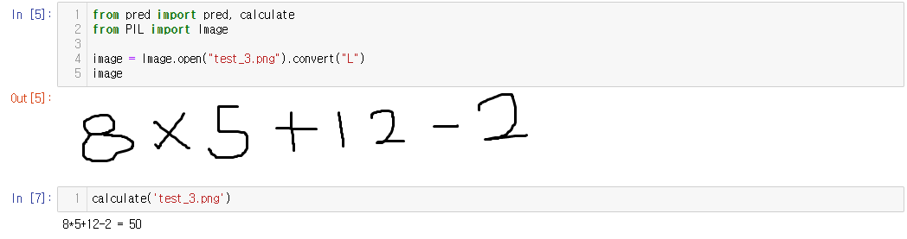

# Model
- 필요한 [data](https://drive.google.com/drive/folders/1Sky2lWnEuSsW4UizwLZkh6e__cY7UjSl)

## issue
1.**가로로 긴거는 상관없지만 세로로 이미지가 길면 인식이 잘 안된다. 프론트쪽이랑 상의가 필요할 듯 하다.**

2.**데이터를 행렬로 넘겨줄건지 이미지로 넘겨줄건지도 상의가 필요할 듯 하다.**

## calculation
Testing1

  
Testing2

  
Testing3
